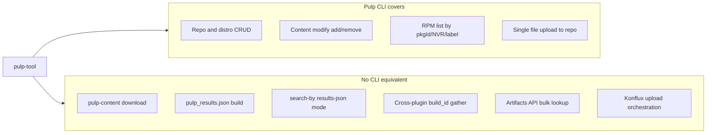

# Pulp CLI gap analysis (vs pulp-tool)

This document lists what **pulp-tool** does today that has **no direct equivalent** in [Pulp CLI](https://pulpproject.org/pulp-cli/), based on mapping against an installed `pulp` client (`pulp rpm`, `pulp file`, `pulp task`, `pulp show`) and pulp-tool’s [`PulpClient`](../pulp_tool/api/pulp_client/client.py) / [`DistributionClient`](../pulp_tool/api/distribution_client.py).

Use it when evaluating a move from the custom httpx client to **pulp-glue** (recommended programmatic layer) or subprocess `pulp` calls.

Related: migration plan in [`.cursor/plans/pulp_cli_migration_b7345de3.plan.md`](../.cursor/plans/pulp_cli_migration_b7345de3.plan.md).

---

## Summary

| Category | Count | Migration implication |
|----------|-------|------------------------|
| Strong pulp-cli fit | ~15 API patterns | Repo/distro CRUD, modify, list, basic upload |
| Partial fit | ~6 patterns | Labels on upload, signed_by search edge cases, task polling |
| **No pulp-cli parallel** | **9 areas** | Stay in pulp-tool or use raw glue/API beyond CLI flags |

---

## What pulp-cli covers well

These pulp-tool operations have a clear `pulp` subcommand (or global flag):

| pulp-tool need | pulp-cli |
|----------------|----------|
| `cli.toml` config | `pulp --config PATH` (same `[cli]` format) |
| OAuth / Basic / mTLS | `--client-id`, `--client-secret`, `--username`, `--password`, `--cert`, `--key` |
| Domain, API root, base URL | `--domain`, `--api-root`, `--base-url` |
| Correlation ID | `--cid` |
| Create/show/list RPM or file repos | `pulp rpm repository …`, `pulp file repository …` |
| Create/show/list distributions | `pulp rpm distribution …`, `pulp file distribution …` |
| Add/remove content in repo | `pulp rpm repository content modify`, `pulp file repository content modify` |
| Upload one RPM into a repo | `pulp rpm content -t package upload --file … --repository …` |
| Upload one file into a repo | `pulp file content upload --file … --relative-path …` |
| List packages in a repo | `pulp rpm repository content list` (used in [e2e/post-test-validation.py](../e2e/post-test-validation.py)) |
| Search RPM by checksum | `pulp rpm content list --pkgId-in …` |
| Search RPM by NVR | `pulp rpm content list --name --version --release --arch` |
| Search RPM by label | `pulp rpm content list --label-select …` |
| Task lookup | `pulp task show`, `pulp task list` |
| Resource by href | `pulp show --href` |

---

## Missing functionality (no pulp-cli parallel)

### 1. Pull: pulp-content HTTP downloads

**pulp-tool:** [`DistributionClient`](../pulp_tool/api/distribution_client.py) streams artifacts from **pulp-content** URLs (not API v3).

**Used by:** `pulp pull` — download RPMs, logs, SBOMs from per-artifact `url` fields in metadata JSON; concurrent workers (`--max-workers`).

**pulp-cli:** No download/stream command for published distribution content.

**Keep:** httpx (or plain HTTP client) for pull downloads even if API v3 moves to pulp-glue.

---

### 2. `pulp_results.json` assembly

**pulp-tool:** Builds Konflux-facing [`pulp_results.json`](../pulp_tool/models/results.py) incrementally during upload: `artifacts` map (key → labels, url, sha256) and `distributions` map (sorted keys → base URLs).

**Used by:** `upload`, `upload-files`; consumed by Konflux Tekton ([`CLAUDE.md`](../CLAUDE.md)).

**pulp-cli:** No command produces this structure.

**Keep:** [`PulpClientResultsMixin`](../pulp_tool/api/pulp_client/results.py) / upload services — orchestration layer, not replaceable by pulp-cli.

---

### 3. `search-by` results-json mode

**pulp-tool:** `search-by --results-json … --output-results …` loads local JSON, searches Pulp, removes matching RPM rows, writes filtered file. Supports `--checksum` / `--filename` extraction, `--signed-by`, `--keep-files`.

**pulp-cli:** No workflow command; only low-level `rpm content list`.

**Keep:** Entire [`search_by.py`](../pulp_tool/cli/search_by.py) results-json path.

---

### 4. Cross-plugin content gather by `build_id`

**pulp-tool:** `GET /api/v3/content/?pulp_label_select=build_id~{id}` via [`find_content`](../pulp_tool/api/pulp_client/content_query.py) — one query across content types after upload.

**pulp-cli:** Per-plugin list with `--label-select` (e.g. `pulp file content list`); no single cross-plugin gather command.

**Keep:** Generic content query or glue equivalent; verify glue exposes pulpcore content list with `pulp_label_select`.

---

### 5. Artifacts API bulk file-location lookup

**pulp-tool:** Chunked `GET /api/v3/artifacts/?pulp_href__in=…` in [`ArtifactMixin.get_file_locations`](../pulp_tool/api/artifacts/operations.py) to resolve download URLs when building results.

**pulp-cli:** No `pulp artifact` command group in standard install (`pulp core` not exposed).

**Keep:** Artifacts list API (glue or thin httpx wrapper).

---

### 6. Konflux upload orchestration

**pulp-tool:** Multi-step workflow not expressible as one pulp command:

- Per-build repos: `{build}/rpms`, `{build}/logs`, `{build}/sbom`, `{build}/artifacts`, optional `{build}/rpms-signed`
- [`--target-arch-repo`](../docs/cli-reference.md): per-arch RPM repos/distributions (`rpm_{arch}` in results)
- [`--signed-by`](../docs/cli-reference.md): label on RPMs + separate signed repo path
- [`--overwrite`](../docs/cli-reference.md): search target repo, `remove_content_units`, then upload
- Per-architecture parallel uploads ([`upload_orchestrator.py`](../pulp_tool/utils/upload_orchestrator.py))
- Lazy repo creation, skip logs/SBOM repo when empty

**pulp-cli:** Primitives only (`repository create`, `content upload`, `modify`). Directory upload (`--directory --use-temp-repository`) is a **different** concurrency/atomicity model.

**Keep:** [`PulpHelper`](../pulp_tool/utils/pulp_helper.py), [`UploadService`](../pulp_tool/services/upload_service.py), orchestration — swap transport underneath only.

---

### 7. In-memory file content upload

**pulp-tool:** [`create_file_content`](../pulp_tool/api/content/file_files.py) posts SBOM/JSON from memory without a temp file (`files={"file": (filename, content, …)}`).

**pulp-cli:** `pulp file content upload` requires `--file FILENAME` on disk.

**Keep:** Glue/API path for in-memory multipart upload, or write temp files (behavior change).

---

### 8. Advanced RPM search queries

**pulp-tool:** Custom logic in [`content_query.py`](../pulp_tool/api/pulp_client/content_query.py) (~775 lines):

| Behavior | pulp-tool | pulp-cli |
|----------|-----------|----------|
| Bulk `pkgId__in` with async concurrent chunks | Yes | `--pkgId-in` only (single list; no merged chunk orchestration in CLI) |
| Combined checksum + `signed_by` in one `q=` | Yes | Separate list filters; no combined command |
| Filename + `signed_by` with repo scope for overwrite | Yes | Partial (`--label-select` + NVR fields) |
| `signed_by` client-side filter when value has `,` or `()` | Yes | Same server limitation; CLI does not add fallback |
| Incremental NVR-by-NVR search in results-json mode | Yes | No |

**Keep:** Isolated query helper for edge cases even if most list calls move to glue.

---

### 9. Higher-level CLI commands

**pulp-tool commands** are workflows; **pulp-cli** is CRUD on Pulp resources:

| pulp-tool command | pulp-cli equivalent |
|-------------------|---------------------|
| `upload` | Many steps: create repos/distros, upload, modify, gather, write JSON |
| `upload-files` | Same stack with explicit file list |
| `pull` | Download (no CLI) + optional re-upload |
| `search-by` | `rpm content list` (+ local JSON filtering) |
| `create-repository` | `repository create` + `distribution create` + `modify` |

pulp-tool remains the Konflux-facing CLI; pulp-cli does not replace it end-to-end.

---

## Partial gaps (CLI exists; workaround needed)

| Gap | pulp-cli option | Gap detail |
|-----|-----------------|------------|
| Labels on upload | `pulp rpm/file content label set` | Upload commands do not accept `pulp_labels` JSON; pulp-tool sets build_id, namespace, parent_package, signed_by at upload time |
| Task wait semantics | Built-in sync wait | pulp-tool uses exponential backoff polling ([`TaskMixin`](../pulp_tool/api/tasks/operations.py)) |
| JSON output shape | `--format json` | Field layout differs from pulp-tool `search-by` stdout |
| Publication / autopublish | `publication create`, `--autopublish` on repo | pulp-tool ties publication updates to distro PATCH in [`repository_manager`](../pulp_tool/utils/repository_manager.py) |

---

## Recommended split for migration

| Layer | Technology |
|-------|------------|
| Repo/distro CRUD, modify, basic list/upload | pulp-glue (pulp-cli ecosystem) |
| Pull downloads | httpx `DistributionClient` (unchanged) |
| Results JSON, Konflux orchestration | pulp-tool (unchanged) |
| Artifacts API, complex search, cross-plugin gather | glue if available; else thin custom module |
| End-user CLI | `pulp-tool` commands unchanged |

---

## Open questions (spike / ADR)

1. **License:** pulp-glue is GPL-2.0-or-later; pulp-tool is Apache-2.0 — legal review before dependency.
2. **Labels on upload:** Does pulp-glue `upload`/`create` accept `pulp_labels` even when CLI help omits them?
3. **Artifacts API:** Which glue context covers `GET /api/v3/artifacts/`?
4. **Container:** UBI image must bundle pulp-glue + plugins if adopted ([`Dockerfile`](../Dockerfile), [changing-pulp-container](../skills/changing-pulp-container/SKILL.md)).

---

## References

- [Pulp CLI docs](https://pulpproject.org/pulp-cli/)
- [Pulp CLI architecture (pulp-glue)](https://pulpproject.org/pulp-cli/docs/dev/learn/architecture/)
- [pulp-tool ARCHITECTURE.md](ARCHITECTURE.md)
- [Konflux contracts (CLAUDE.md)](../CLAUDE.md)
- [CLI reference — search-by, upload flags](cli-reference.md)
