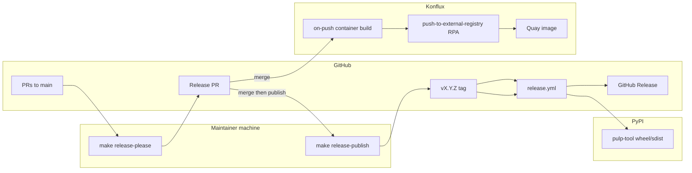

# Releasing pulp-tool

Maintainer guide for publishing **`pulp-tool`** to [PyPI](https://pypi.org/project/pulp-tool/) and coordinating the Konflux **container** image. For day-to-day development and pull requests, see [CONTRIBUTING.md](../CONTRIBUTING.md).

## Overview

| Artifact | When | Mechanism |
|----------|------|-----------|
| **Container image** | Merge to **`main`** (including the Release Please PR) | [`.tekton/pulp-tool-container-build-push.yaml`](../.tekton/pulp-tool-container-build-push.yaml) → promote with your RPA (`push-to-external-registry`) |
| **Python package (PyPI)** | **`v*`** tag on **`main`** | [`.github/workflows/release.yml`](../.github/workflows/release.yml) — build, GitHub Release, PyPI upload |

**Release PR automation** uses [Release Please](https://github.com/googleapis/release-please) run **locally** by maintainers ([`scripts/release-please.sh`](../scripts/release-please.sh)). It opens a Release PR with [`CHANGELOG.md`](../CHANGELOG.md) and [`.release-please-manifest.json`](../.release-please-manifest.json) updates. **Merging that PR** rebuilds the container on `main`. A separate local step (**`make release-publish`**) creates the **`v*` git tag** for PyPI.

Manual tagging (below) remains supported for hotfixes or when Release Please is skipped.



## One-time setup

### PyPI trusted publisher

Upload uses [PyPI trusted publishing](https://docs.pypi.org/trusted-publishers/) (OpenID Connect from GitHub Actions). No `PYPI_API_TOKEN` or other PyPI repository secret is required.

At https://pypi.org/manage/account/publishing/, add a publisher for the **`pulp-tool`** project with values that **exactly** match this repository and workflow:

| Field | Value |
|-------|--------|
| PyPI project name | `pulp-tool` |
| Owner | `konflux-ci` |
| Repository name | `pulp-tool` |
| Workflow name | `release.yml` |
| Environment name | *(leave blank — the workflow does not set a GitHub Environment)* |

Register the publisher before the first tag-driven release (or use a pending publisher so the project is created on first successful upload).

### GitHub repository

- Ensure **Actions** is enabled for the repository (tag push runs [`.github/workflows/release.yml`](../.github/workflows/release.yml)).
- The upload job in [`.github/workflows/release.yml`](../.github/workflows/release.yml) grants **`id-token: write`** only on **`upload-to-pypi`** (required for trusted publishing). Do not add that permission elsewhere.
- **`create-github-release`** uses **`contents: write`** only on that job.
- If you previously stored **`PYPI_API_TOKEN`**, revoke the token on PyPI and remove the repository secret; it is no longer used.

Optional hardening: create a GitHub **Environment** (e.g. `pypi`) with required reviewers, add `environment: pypi` to the upload job, and set the same environment name on the PyPI trusted publisher. That is not configured in the workflow today.

### Release Please (local CLI)

Release Please does **not** run in GitHub Actions for this repository. Maintainers run it from a checkout of **`main`**.

**Prerequisites**

| Requirement | Notes |
|-------------|--------|
| **Node.js + npm** | For `npx release-please@…` on **`make release-please`** (or install globally: `npm i -g release-please`) |
| **GitHub CLI (`gh`)** or **token** | **`make release-please`** calls the GitHub API to open/update the release PR. Use `gh auth login` (recommended) or set `GITHUB_TOKEN` / `GH_TOKEN` with **contents** and **pull-requests** write. There is no token-free mode for this step. |
| **Git push access** | **`make release-publish`** only runs `git tag` + `git push` (SSH or HTTPS); no GitHub API token |
| **Clean `main` checkout** | `git checkout main && git pull <remote> main` before `make release-please` (use `upstream` when `RELEASE_GIT_REMOTE=upstream`) |

**Configuration files**

| File | Role |
|------|------|
| [`release-please-config.json`](../release-please-config.json) | `simple` release type (no `pyproject.toml` version bump — [setuptools-scm](../pyproject.toml) reads the git tag), Keep a Changelog sections |
| [`.release-please-manifest.json`](../.release-please-manifest.json) | Last released version (updated in the release PR) |

Tags use the **`v` prefix** (e.g. **`v1.2.3`**) to match [`.github/workflows/release.yml`](../.github/workflows/release.yml) and [setuptools-scm](../pyproject.toml).

**Commands**

```bash
# release-pr: gh auth is enough (no exported GITHUB_TOKEN required)
gh auth login
make release-please

# Dry-run (no PR created):
./scripts/release-please.sh pr -- --dry-run --debug

# After merging the release PR — tag via git (no GitHub API token)
make release-publish
```

Pin the CLI version with `RELEASE_PLEASE_VERSION` (default **`17.2.0`** in the script). Override the GitHub repo with `GITHUB_REPOSITORY=owner/repo`, or set **`RELEASE_GIT_REMOTE`** so both `release-please` and `release-publish` infer `owner/repo` from that remote (default **`origin`**).

### Fork and upstream remotes

If you use a personal fork as **`origin`** and the canonical repo as **`upstream`** (e.g. `konflux-ci/pulp-tool`), releases must target **`upstream`** — PyPI trusted publishing and [`.github/workflows/release.yml`](../.github/workflows/release.yml) are registered for the canonical repo, not your fork.

```bash
# Sync main from upstream before releasing
git checkout main && git fetch upstream && git pull --ff-only upstream main

# Open/update Release PR on konflux-ci/pulp-tool (inferred from upstream URL)
RELEASE_GIT_REMOTE=upstream make release-please

# After merging the Release PR — push v* tag to upstream (triggers release.yml + PyPI)
RELEASE_GIT_REMOTE=upstream make release-publish
```

You can still set `GITHUB_REPOSITORY=konflux-ci/pulp-tool` explicitly if the remote URL is not on github.com. `gh auth login` must have permission to open PRs on the canonical repo.

### Konflux container (optional RPA)

Merging the Release Please PR (or any push) to **`main`** runs [`.tekton/pulp-tool-container-build-push.yaml`](../.tekton/pulp-tool-container-build-push.yaml), which builds:

`quay.io/redhat-user-workloads/artifact-storage-tenant/tooling/pulp-tool-container:latest`

Wire your **Release Plan Admission** to [`push-to-external-registry`](https://github.com/konflux-ci/release-service-catalog/tree/development/pipelines/managed/push-to-external-registry) to promote that image. There is **no** separate on-tag container build — the release commit is already on `main` when the release PR merges.

## Version numbers

Package version comes from [setuptools-scm](https://setuptools-scm.readthedocs.io/) and the git tag (see `[tool.setuptools_scm]` in [`pyproject.toml`](../pyproject.toml)). Tag **`v1.2.3`** produces version **`1.2.3`**. The release workflow sets **`SETUPTOOLS_SCM_PRETEND_VERSION`** from the pushed tag so PyPI never receives a local/dev version (e.g. `1.2.3.dev0+g…`, which PyPI rejects).

Build metadata in tags (e.g. **`v1.2.3+build.1`**) is accepted by the workflow; confirm how `setuptools_scm` maps that to the PyPI version string before publishing non-standard tags.

## Automated release (recommended)

1. Merge feature PRs to **`main`** with conventional commit prefixes where possible (`feat:`, `fix:`, …). Continue adding user-facing notes under **`[Unreleased]`** in [`CHANGELOG.md`](../CHANGELOG.md) when helpful — Release Please consolidates them into the release PR.
2. On **`main`**, run **`make release-please`**. Review the Release PR on GitHub (title like `chore: release X.Y.Z`).
3. **Review the Release PR** — confirm CI is green (`make test`, `make pre-commit-ci`, or `make test-diff-coverage` after `git fetch origin`).
4. **Merge the Release PR** on GitHub — Konflux rebuilds **`pulp-tool-container`** on `main` (then your RPA promotes the image).
5. Run **`make release-publish`** locally (creates tag **`vX.Y.Z`** on `main` from [`.release-please-manifest.json`](../.release-please-manifest.json) **after** the release PR merge is pulled — the script syncs from `RELEASE_GIT_REMOTE` before reading the manifest).
6. Tag push starts **`release.yml`** — build & inspect, **GitHub Release** (notes from CHANGELOG), **PyPI** upload.

### Maintainer gates

- **Human merge** of the Release Please PR is the release approval gate (container + changelog land on `main`).
- **`make release-publish`** is the deliberate step that cuts the PyPI tag.
- Optional: add a GitHub **Environment** on `upload-to-pypi` for extra PyPI approval (see one-time setup).
- **Do not** use Konflux [`release-to-github`](https://github.com/konflux-ci/release-service-catalog/tree/development/pipelines/managed/release-to-github) for PyPI — that pipeline attaches **binaries extracted from container images**, not Python sdist/wheel from git tags.

## Manual release (hotfix or bypass)

1. Merge changes to **`main`** and confirm CI is green.
2. Update [`CHANGELOG.md`](../CHANGELOG.md): move items from **`[Unreleased]`** into a new **`[X.Y.Z]`** section with the release date, and add compare links at the bottom per [Keep a Changelog](https://keepachangelog.com/).
3. Commit the changelog update on **`main`** if it is not already included.
4. Tag and push:

```bash
git checkout main
git pull origin main
git tag v1.2.3
git push origin v1.2.3
```

5. Bump [`.release-please-manifest.json`](../.release-please-manifest.json) to **`"1.2.3"`** on `main` in a follow-up PR so Release Please stays in sync.

Tags must match **`vMAJOR.MINOR.PATCH`** with optional SemVer pre-release and build metadata (e.g. **`v1.2.3`**, **`v1.2.3-rc1`**, **`v1.2.3+build.1`**) and must point at a commit on **`main`**. Other tags are rejected by the workflow.

## What runs on tag push

**Release python package** ([`.github/workflows/release.yml`](../.github/workflows/release.yml)):

1. **Build & inspect package** — builds sdist and wheel with Python **3.12**, runs wheel/README checks via [`hynek/build-and-inspect-python-package`](https://github.com/hynek/build-and-inspect-python-package).
2. **Create GitHub Release** — release notes from the matching **`## [X.Y.Z]`** section in [`CHANGELOG.md`](../CHANGELOG.md) (via [`.github/scripts/extract-changelog-notes.sh`](../.github/scripts/extract-changelog-notes.sh)); pre-releases when the tag contains **`-`**.
3. **Upload package to PyPI** — [`pypa/gh-action-pypi-publish`](https://github.com/pypa/gh-action-pypi-publish) with trusted publishing (OIDC).

Container images are **not** rebuilt on tag push; they are produced when the release commit merges to **`main`** (see [Konflux container](#konflux-container-optional-rpa) above).

## Verify the release

- In GitHub **Actions**, open the workflow run for the tag and confirm build, GitHub Release, and PyPI jobs succeeded.
- On GitHub **Releases**, confirm the release page and notes.
- On PyPI, confirm the new version at https://pypi.org/project/pulp-tool/
- On Quay, confirm the container image from the release PR merge (after RPA, if configured).
- Optionally install locally: `pip install pulp-tool==1.2.3`

## Troubleshooting

| Issue | Check |
|-------|-------|
| No Release Please PR | Run `make release-please` on up-to-date `main`; ensure commits since last tag warrant a release; try `--dry-run --debug` |
| `release-please` / `npx` not found | Install Node.js/npm or `npm i -g release-please` |
| Token errors on `make release-please` | Run `gh auth login` or set `GITHUB_TOKEN` with contents + pull-requests write; Release Please cannot open PRs without GitHub API auth |
| `make release-publish` auth failed | Configure git push (SSH key or HTTPS credential helper); this step does not use `GITHUB_TOKEN` |
| Tag not created after release PR merge | Run `make release-publish` locally — tagging is not automatic on merge |
| Wrong tag version on publish | Ensure the release PR is merged and run publish **after** the script pulls `main` (it reads `.release-please-manifest.json` from the synced tree, not a stale local copy). Delete a mistaken tag on the remote if needed before re-publishing. |
| Tag pushed to fork by mistake | Use `RELEASE_GIT_REMOTE=upstream make release-publish` (or `git push upstream vX.Y.Z`); PyPI expects tags on `konflux-ci/pulp-tool` |
| Release Please PR out of sync after manual tag | Update [`.release-please-manifest.json`](../.release-please-manifest.json) to the released version on `main` |
| Workflow did not start | Tag must match `v*` and be pushed to the canonical repo (`RELEASE_GIT_REMOTE=upstream` or `git push upstream vX.Y.Z`) |
| Tag format rejected | Use SemVer tags such as `v1.2.3`, `v1.2.3-rc1`, or `v1.2.3+build.1` (not `1.2.3` without the `v` prefix) |
| Not on `main` | Tag must point at a commit reachable from `main` (checked via GitHub compare API) |
| Upload auth failed | PyPI trusted publisher must match `konflux-ci` / `pulp-tool` / workflow `release.yml` with a blank environment name; upload job needs `id-token: write` |
| PyPI 400 local version (`+g…` or `.dev0`) | Tag build must use a clean semver — [`.github/workflows/release.yml`](../.github/workflows/release.yml) sets `SETUPTOOLS_SCM_PRETEND_VERSION` from the tag; re-run after that fix is on `main`, or delete the tag and re-push on a commit that includes the fix |
| Empty GitHub Release notes | Ensure `CHANGELOG.md` has a **`## [X.Y.Z]`** section for that version before tagging |
| Wrong package version | Tag name must match the intended release; rebuild requires a new tag |
| Container not rebuilt | Merging the release PR must land on `main`; check Konflux PipelineRun `pulp-tool-container-on-push` |
