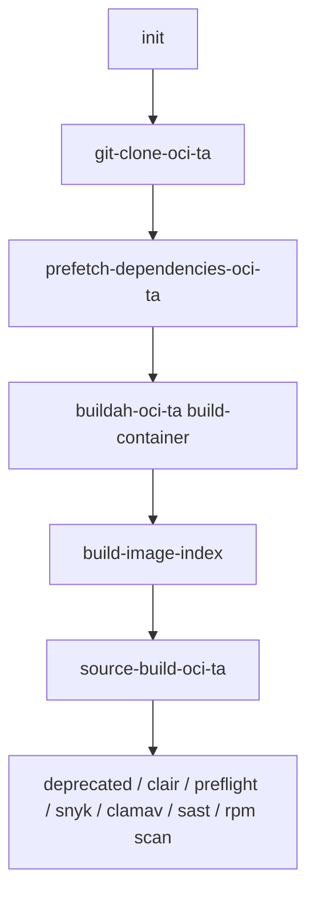

# Konflux container build — pipeline reference

Source: [docker-build-oci-ta.yaml](https://github.com/konflux-ci/container-build-catalog/blob/main/pipelines/docker-build-oci-ta/docker-build-oci-ta.yaml) (resolved at `main` by pulp-tool `.tekton/` PipelineRuns).

pulp-tool **does not** vendor this pipeline; it is fetched via `pipelineRef.resolver: git`. Re-open the upstream file when tasks or bundle digests change.

## Pipeline parameters (defaults relevant to pulp-tool)

| Param | Default | pulp-tool usage |
|-------|---------|-----------------|
| `path-context` | `.` | Repo root |
| `dockerfile` | `Dockerfile` | Root [Dockerfile](../../Dockerfile) |
| `hermetic` | `false` | Network allowed during image build (`dnf`, `pip`) |
| `prefetch-input` | `''` | No Hermeto/Cachi2 prefetch config in-repo |
| `skip-checks` | `false` | Post-build scans run on PR and main |
| `build-source-image` | `false` | **`true`** in pulp-tool PipelineRuns (release `push-snapshot` publishes `.src` source container) |
| `build-image-index` | `false` | Index task runs but passes through single image |
| `buildah-format` | `docker` | Docker-format image mediaType |
| `image-expires-after` | `''` | PR PipelineRun sets `5d` |

pulp-tool PipelineRuns pass: `git-url`, `revision`, `output-image`, **`build-source-image: "true"`**; PR also passes `image-expires-after`.

## Task flow

### Tasks (in order)

| Task | Catalog task | Role |
|------|--------------|------|
| `init` | `init` | Decide whether to build; proxy settings |
| `clone-repository` | `git-clone-oci-ta` | Clone `git-url` @ `revision`; workspace `git-auth` |
| `prefetch-dependencies` | `prefetch-dependencies-oci-ta` | Hermeto/Cachi2 prefetch (no-op with empty `prefetch-input`) |
| **`build-container`** | **`buildah-oci-ta`** | **Buildah build of `DOCKERFILE` in `CONTEXT`; push `output-image`** |
| `build-image-index` | `build-image-index` | Image index / pass-through; pipeline results source |
| `build-source-image` | `source-build-oci-ta` | **Enabled** — pushes `{digest}.src` source container for release |
| `deprecated-base-image-check` | `deprecated-image-check` | Base image deprecation |
| `clair-scan` | `clair-scan` | Vulnerability scan |
| `ecosystem-cert-preflight-checks` | `ecosystem-cert-preflight-checks` | Red Hat cert preflight |
| `sast-snyk-check` | `sast-snyk-check-oci-ta` | SAST (Snyk) |
| `clamav-scan` | `clamav-scan` | Malware scan |
| `sast-shell-check` | `sast-shell-check-oci-ta` | Shell script SAST (Conforma required task) |
| `sast-unicode-check` | `sast-unicode-check-oci-ta` | Unicode SAST (Conforma required task) |
| `apply-tags` | `apply-tags` | Apply Konflux tags |
| `push-dockerfile` | `push-dockerfile-oci-ta` | Push Dockerfile artifact |
| `rpms-signature-scan` | `rpms-signature-scan` | RPM signature scan (Conforma required task) |

This pipeline does **not** include deprecated `sbom-json-check`.

### build-container (where Dockerfile failures surface)

Key params wired by the pipeline:

- `IMAGE` → `output-image` (Quay tag from `.tekton/` PipelineRun)
- `DOCKERFILE` → `Dockerfile` (default)
- `CONTEXT` → `.` (repo root)
- `HERMETIC` → `false` (allows `dnf`/`pip` network in Dockerfile)
- `SOURCE_ARTIFACT` / `CACHI2_ARTIFACT` from clone + prefetch tasks

A failing `pip install` or bad base image digest typically fails **`build-container`** in the **builder** stage, not GitHub Actions. The runtime stage only runs a minimal `microdnf install` (no `update`) and copies `/app/install` from the builder.

## Pipeline results

- `IMAGE_URL`, `IMAGE_DIGEST` — from `build-image-index`
- `CHAINS-GIT_URL`, `CHAINS-GIT_COMMIT` — from `clone-repository`

## In-repo PipelineRun differences

| | push (`pulp-tool-container-on-push`) | PR (`pulp-tool-container-on-pull-request`) |
|--|--------------------------------------|--------------------------------------------|
| PAC trigger | `push` && `main` | `pull_request` && `main` |
| `cancel-in-progress` | `false` | `true` |
| `output-image` tag | `:latest` | `:on-pr-{{revision}}` |
| `build-source-image` | `"true"` | `"true"` |
| `image-expires-after` | (pipeline default empty) | `5d` |
